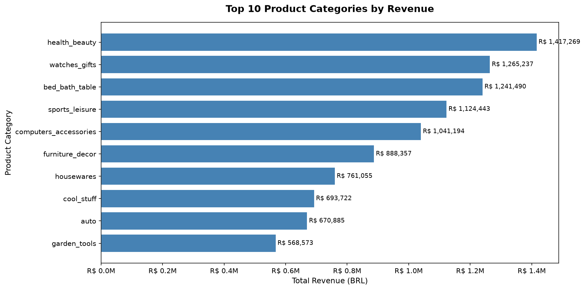
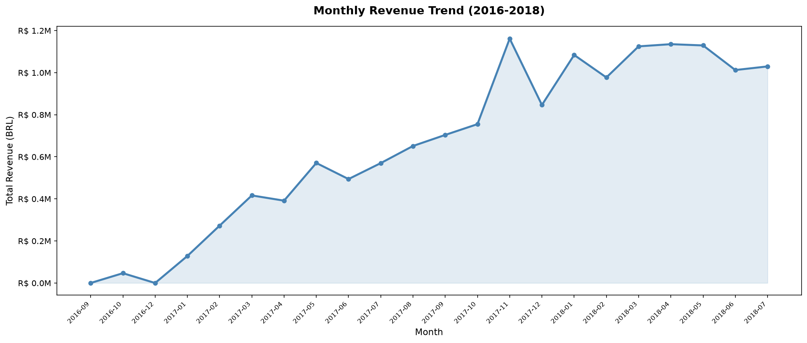
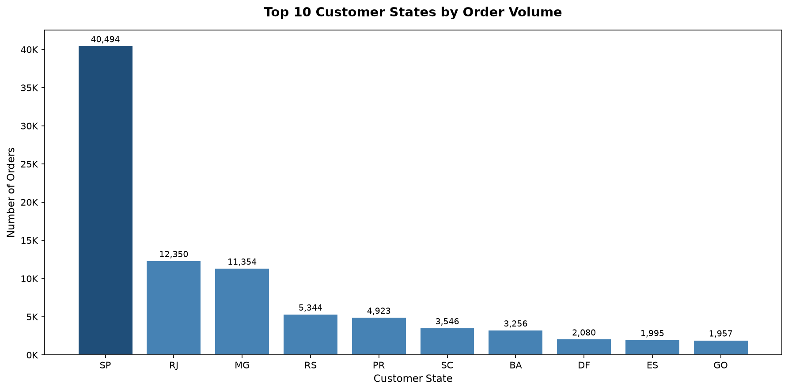
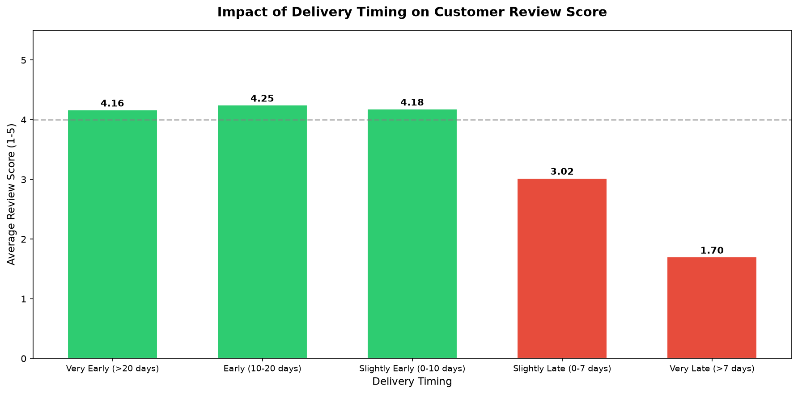
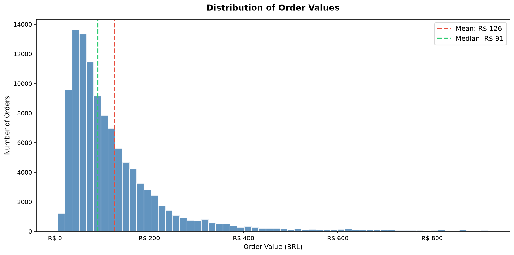
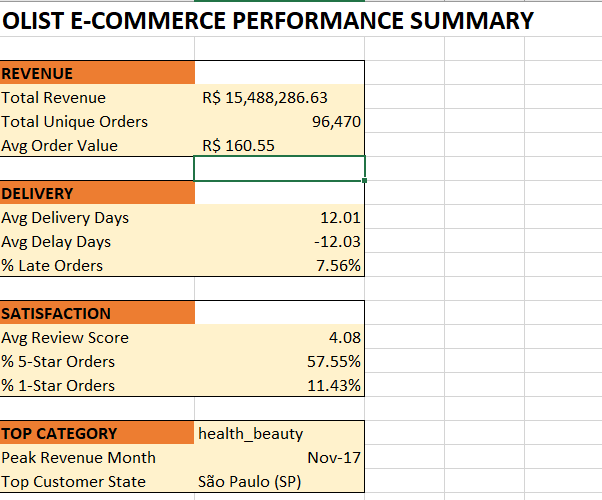
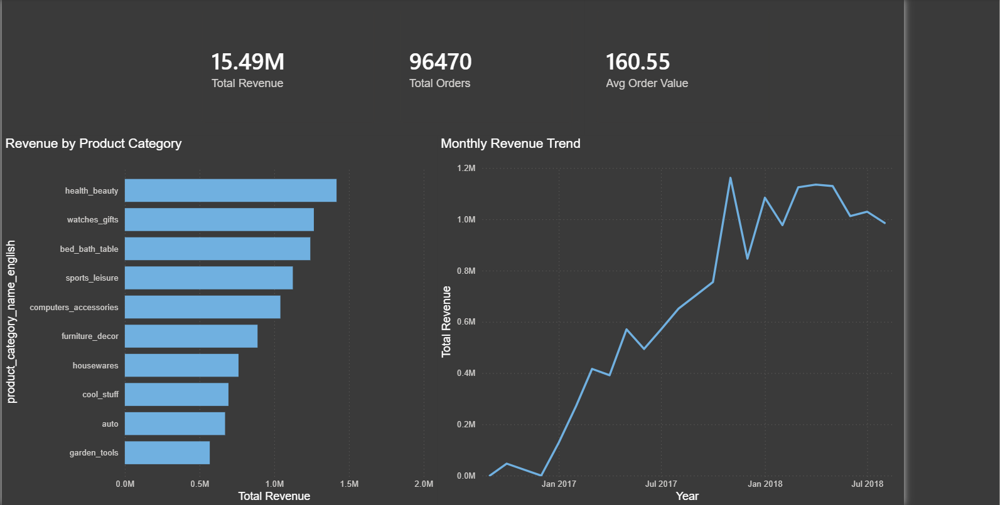
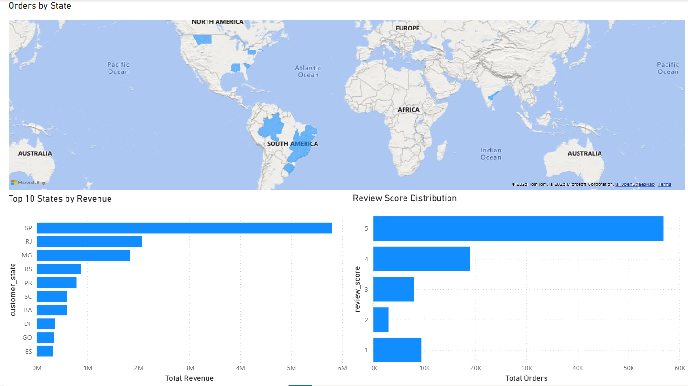
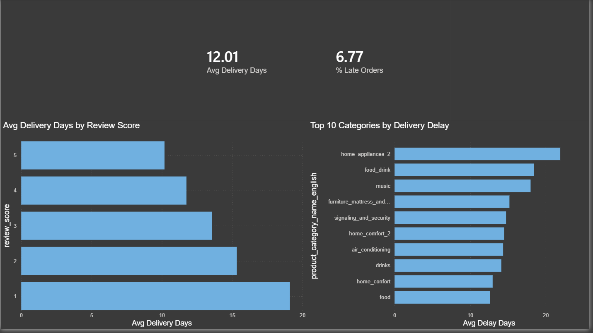

# Olist E-Commerce Analytics Project

## Project Overview
End-to-end analytics project using real Brazilian e-commerce data from Olist marketplace. 
The project covers the full analytics workflow — data cleaning, exploratory analysis, SQL querying, Excel reporting, and Power BI dashboarding — to answer real business questions about revenue, customer behavior, and delivery performance.

**Dataset:** [Olist Brazilian E-Commerce Public Dataset](https://www.kaggle.com/datasets/olistbr/brazilian-ecommerce)  
**Records Analyzed:** 110,832 order items across 96,470 unique orders  
**Tools Used:** Python (pandas, matplotlib) | SQLite (SQL) | Excel | Power BI  

---

## Business Questions Answered
1. Which product categories generate the most revenue?
2. How has monthly revenue trended over time?
3. Which customer states place the most orders?
4. Does delivery delay impact customer review scores?
5. What is the distribution of order values?
6. What percentage of orders are delivered late?
7. Which product categories have the worst delivery delays?
8. Who are the top performing sellers by revenue?

---

## Project Structure

---

## Phase 1 — Data Cleaning & Preparation (Python)
**File:** `scripts/01_data_exploration.py`

- Loaded 9 raw CSV files totaling 100,000+ records
- Converted 5 timestamp columns from object to datetime
- Engineered 3 new columns: `delivery_days`, `delivery_delay_days`, `approval_days`
- Filtered to delivered orders only (96,470 out of 99,441 — 97%)
- Joined 6 tables into a single master table with 26 columns
- Handled nulls: filled missing category names as `uncategorized`, retained review nulls

**Key finding:** 8 nulls existed in delivery dates even within delivered orders — dropped as negligible (0.008% of data)

---

## Phase 2 — Exploratory Data Analysis (Python + matplotlib)
**File:** `scripts/02_eda_visualizations.py`

### Chart 1 — Top 10 Product Categories by Revenue

**Finding:** `health_beauty` leads with R$1.42M in revenue. `watches_gifts` has the highest average order value at R$215 despite being second in total revenue.

### Chart 2 — Monthly Revenue Trend

**Finding:** Revenue grew from near zero in late 2016 to consistently R$1M+ per month by 2018. November 2017 spike (R$1.16M) aligns with Black Friday.

### Chart 3 — Top 10 Customer States by Order Volume

**Finding:** São Paulo (SP) dominates with 40,494 orders — 3x more than Rio de Janeiro (RJ) at 12,350.

### Chart 4 — Delivery Timing vs Review Score

**Finding:** Early deliveries average 4.21 review score. Late deliveries drop to 2.26 — a 1.95 point gap. Delivery timing is the single biggest driver of customer satisfaction.

### Chart 5 — Order Value Distribution

**Finding:** Right-skewed distribution. Median order value is R$91, mean is R$126. Most orders cluster between R$25-R$150.

---

## Phase 3 — SQL Business Analysis (SQLite)
**File:** `scripts/03_sql_analysis.py`

| Query | Key Finding |
|---|---|
| Overall KPIs | Total revenue R$15.49M, 96,470 orders, avg order value R$160.55 |
| Category Revenue | health_beauty #1 at R$1.42M; watches_gifts highest AOV at R$215 |
| YoY Monthly Revenue | January 2018 (R$1.08M) is 8x January 2017 (R$128K) |
| State Performance | SP generates R$5.79M — 3x RJ's R$2.06M |
| Basket Size | 87% of orders contain only 1 item — cross-sell opportunity |
| Delivery Performance | 7.56% late orders; avg delivery 12 days |
| Worst Delay Categories | home_appliances_2 averages 21.9 days late |
| Review Distribution | 59% of customers give 5 stars; 9.77% give 1 star |
| Late vs Early Reviews | Late orders score 2.26 vs early orders 4.21 |
| Top Sellers | Top seller generated R$247K from 1,124 orders |

---

## Phase 4 — Excel Analysis
4 pivot tables and 1 KPI summary dashboard built on the master dataset.

*(Excel file not included due to size — screenshots below)*

---

## Phase 5 — Power BI Dashboard
3-page interactive dashboard covering sales overview, regional analysis, and delivery performance.

*(Power BI screenshots below)*

---

## Key Business Insights

1. **Delivery is the #1 satisfaction driver** — Late orders score 46% lower than early ones (2.26 vs 4.21). Fixing the 7.56% late orders would disproportionately improve platform rating.

2. **health_beauty dominates revenue but watches_gifts dominates value** — Different inventory and pricing strategies are needed for each category type.

3. **São Paulo is the core market** — SP contributes 37% of total revenue. Regional logistics investment should prioritize SP first.

4. **Black Friday drives peak revenue** — November 2017 was the single highest revenue month. Seasonal inventory planning should account for this spike.

5. **87% of customers buy only one item** — Significant cross-sell opportunity through product recommendations and bundling.

---

## How to Reproduce This Project
1. Download the raw dataset from [Kaggle](https://www.kaggle.com/datasets/olistbr/brazilian-ecommerce)
2. Update `base_path` in `01_data_exploration.py` to your local data folder
3. Run scripts in order: `01` → `02` → `03`
4. Open `olist_powerbi_dashboard.pbix` in Power BI Desktop

---

## Tools & Libraries
- **Python 3.13** — pandas, matplotlib
- **SQLite** — via Python sqlite3 library
- **Microsoft Excel** — Pivot tables, conditional formatting, KPI dashboard
- **Power BI Desktop** — DAX measures, interactive dashboard

---
*Dataset source: Olist Brazilian E-Commerce Public Dataset — real transactional data from a Brazilian marketplace (2016-2018)*
